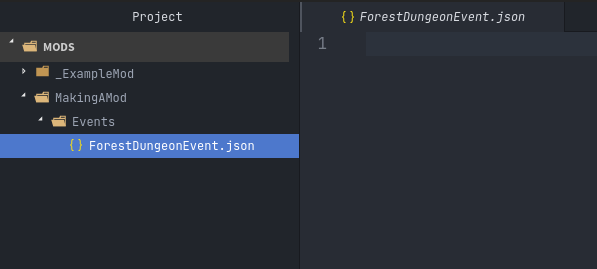

.. _Overview:

**Making A Mod**
=================

In this brief step-by-step tutorial, you will make your first proof-of-concept mod.
By the end of the tutorial, you will have a simple event you can interact with in the Shopping center of the Town.

You will not be coding in Python. 
Instead, you will be making mods in precisely the same way Threshold makes content for the game: 
creating folders containing plain text files in a format called JSON.

Threshold designed it so that content for the game can be written in plain English words, and minimal actual coding, making everything much easier to comprehend.

**The Mods Folder**
-------------------

In order for the game to find and load your mod, it must be located in the game folder titled ``Mods``.
See the instructions on where to locate the Mods folder inside your given text editor:

.. tabs::

    .. tab:: VS Code

        **On Windows/Linux:**

            1. Go to File -> Add Folder To Workspace...
            2. Navigate to the base Monster Girl Dreams folder where you launch the game executable
            3. Click on ``Mods``, click Select Folder.

        **On macOS:**

            1. Go to File -> Add Folder To Workspace...
            2. Go to Applications, right-click the MonGirlDreams application, and select "Show Package Contents". 
            3. Navigate to ``Contents/Resources/autorun/``, click the ``Mods`` folder, click Open.
    
        .. image:: img/vscode.png
            :align: center

    .. tab:: Pulsar

        **On Windows/Linux:**

            1. Go to File -> Add Project Folder
            2. Navigate to the base Monster Girl Dreams folder where you launch the game executable,
            3. Click on ``Mods``, click Select Folder.

        **On macOS:**

            1. Go to File -> Add Project Folder
            2. Go to Applications, right-click the MonGirlDreams application, and select "Show Package Contents". 
            3. Navigate to ``Contents/Resources/autorun/``, click the ``Mods`` folder, click Open.

        .. image:: img/atom.png
            :align: center

    .. tab:: Notepad++
        
        1. Don't open Notepad++, open File Explorer.
        2. Open the base folder of Monster Girl Dreams, where you launch the game executable. 
        3. Navigate to ``\Mods\``.
        
        .. image:: img/windowspath.png
            :align: center

You may have noticed the mod already present in the Mods folder, titled ``_ExampleMod``. This is an example mod by Threshold. 
It's currently disabled because of the _underscore in front of the folder's name, preventing the game from loading the mod. 
To activate the mod, right-click, rename, and remove the _underscore, leaving it as ``ExampleMod``. 
This is the equivalent and underlying functionality for disabling and enabling a mod via the in-game Mods menu.

.. tip::

    If you wanted to check ExampleMod in-game, you can find it at the Mountain, under Events in the Grimoire titled **Perpetua Returns!**

**Making Your Own**
--------------------

Right-click the Mods folder, create a new folder, and name it as you please, such as ``MakingAMod``.

Any files you place directly here will be ignored by the game. 
The game will look inside your mod and check for specific folders titled any of the following:

* **Adventures**
* **Events**
* **Fetishes**
* **Items**
* **Locations**
* **Monsters**
* **Perks**
* **Skills**

Each of these folders contains a specific type of JSON file that the game will load into its respective databases on startup. 

.. seealso::
    
    Optionally see :ref:`JSON Folders Overview` for more information on each type.

Since you will be adding an Event to the Shopping center, right-click the folder of your mod and create a folder titled ``Events``. You do not need to add the other types of JSON folders listed above, since you are not using them.

**Making an Event JSON**
-------------------------

Right-click the Events folder, and make a file titled ``ShoppingEvent.json``. You could title it how you like, as long as it ends with ``.json``, else the file will not be loaded by the game.

At this point, your mod folder structure should look something like the image below.

Double-click your file to open it. It should currently be empty.

The game expects the contents of a JSON file to follow specific structural patterns. 
Typing it by hand is impractical, which is why you can use the blank template provided by the base game files and copy/paste its contents into ``ShoppingEvent.json``.  (Or type ``Create Event`` and press enter via the VS Code MGD Language extension.)

To find it in your respective editor:

.. tabs::

    .. tab:: VS Code

            1. Go to *File* -> *Add Folder To Workspace...*
            2. Go back to the ``game`` folder, click on ``Json``, click Select Folder/Open.
            3. In your workspace view, navigate within the Json folder to ``Events/_BlankEvent.json``, and open the file.
            4. Select all file contents, ``ctrl`` / ``⌘`` + ``c`` to copy.
            5. Go to your ``ShoppingEvent.json`` tab, ``ctrl`` / ``⌘`` + ``v`` to paste.
    
        .. image:: img/vscodeprojectview.png
            :align: center

    .. tab:: Pulsar

            1. Go to *File* -> *Add Project Folder*
            2. Go back to the ``game`` folder, click on ``Json``, click Select Folder/Open.
            3. In your project view, navigate within the Json folder to ``Events/_BlankEvent.json``, and open the file.
            4. Select all file contents, ``ctrl`` / ``⌘`` + ``c`` to copy.
            5. Go to your ``ShoppingEvent.json`` tab, ``ctrl`` / ``⌘`` + ``v`` to paste.

        .. image:: img/atomprojectview.png
            :align: center

    .. tab:: Notepad++
        
        1. Open new File Explorer window.
        2. Navigate to ``game\Json\Events\_BlankEvent.json`` open in Notepad++, 
        3. Select all file contents, ``ctrl+c`` to copy.
        4. Go to your ``ShoppingEvent.json`` tab, ``ctrl+v`` to paste.

**Keys And Values**
---------------------

Notice how there's a particular way everything has been structured.

You thankfully don't have to understand precisely how the structure of a JSON works. 
You can get by using the :ref:`Linter` from your text editor. 
It will warn you if something went wrong with the files structure that would otherwise prevent the game from loading.

But there are some general words you should know, so you can better understand other parts of the modding documentation in the future.

First, start with the top of the file:

.. code-block:: javascript

    "name": "",

Every JSON file structures has two sides, the **key** (``"name":``), and the **value** (``""``).

You will only have to modify the **value** side of these structures while modding. The **keys** side never needs their text modified.

Values will always be inside of **strings**. Strings are a pair of double quotation marks ``""``.

**Providing Values**
---------------------

This tutorial will proceed to give example values to fill your event with, 
which will be an event in the shopping district of the Town in-game.

Starting with the name key at the top of your file, provide it with a value of ``"Slimey Customer Encounter!"``.
This is what will be displayed to the Player when they go 'Shopping' in the Town.
The value for a name key in a new event should always be something unique in order to avoid being mixed up with Events from the base game. 

.. code-block:: javascript

    "name": "Slimey Shopping Encounter!",
    "CardType": "",
    "CardLimit": "",
    "Description": "",
    "requires": [""],
    "requiresEvent": [
        {
            "NameOfEvent": "",
            "Progress": "99",
            "Choice": "",
            "ChoiceNumber": "-1"
        }
    ],
    "Speakers": [
        {
            "name": "Blue Slime",
            "postName": "",
            "SpeakerType": ""
        }
    ],

In order for the game to know this event is meant to be included in the Shopping section of the Town, 
we need to change the value of the ``"CardType":`` key to ``"Shopping"``.

Now, give ``"CardLimit":`` the value of ``"0"``, as this key is unused for CardTypes of Shopping, but still needs a numerical value for technical reasons.

``"Description":`` can be left empty, as it also isn't used by CardTypes of Shopping.

``"requires":`` and ``"requiresEvent":`` are capable of limiting a Players access to an Event depending on if they do or do not meet the conditions given.
These can also be skipped and left alone this time.

``"Speakers":`` is unique, as its structure contains other keys. 
You will only need to change the Speakers ``"name":`` key for this Event. Change its value to ``"Blue Slime"``, as this Monster will be used in this Event.

The result thus far should look like this:

.. code-block:: javascript

    "name": "Slimey Shopping Encounter!",
    "CardType": "Shopping",
    "CardLimit": "0",
    "Description": "",
    "requires": [""],
    "requiresEvent": [
        {
            "NameOfEvent": "",
            "Progress": "99",
            "Choice": "",
            "ChoiceNumber": "-1"
        }
    ],
    "Speakers": [
        {
            "name": "Blue Slime",
            "postName": "",
            "SpeakerType": ""
        }
    ],

**EventText**
--------------

A majority of time making Events is spent inside the ``"EventText":`` key. This is where most of the game's dialogue and narration takes place.

.. code-block:: javascript

    "EventText": [
        {
            "NameOfScene": "",
            "theScene": [
                ""
            ]
        }
    ]

Like the Speakers key, it contains a structure that holds other keys. 
Notice the two curly brackets ``{}`` that surround the two keys it contains.
The structure between these curly brackets can be duplicated in order to make more scenes, 
for as long as it stays within the square brackets ``[]`` of EventText.

1. Place your curser to the right of the closing curly bracket ``}``.
2. Create a new line with the enter key.
3. Copy and paste the contents of the above curly brackets on the new line, giving two scenes. (Or type ``Scene`` and press enter via the VS Code MGD Language extension.)

It should look like this:

.. code-block:: javascript

    "EventText": [
        {
            "NameOfScene": "",
            "theScene": [
                ""
            ]
        }
        {
            "NameOfScene": "",
            "theScene": [
                ""
            ]
        }
    ]

If you're using a :ref:`Linter`, you should be noticing a red dot, indicating an error. 
This is because this breaks how a JSON file is supposed to be structured. 
If you were to try to launch the game, this would cause it to crash, as it wouldn't be able to understand the file.

To fix this, place a comma ``,`` at the end of the first pair of curly brackets. 
This will tell the game that it's safe to move to the next scene when it reads the file. 

It should look like this:

.. code-block:: javascript

    "EventText": [
        {
            "NameOfScene": "",
            "theScene": [
                ""
            ]
        },
        {
            "NameOfScene": "",
            "theScene": [
                ""
            ]
        }
    ]

**NameOfScene & theScene**
---------------------------

It's time to truly start writing the scenes for the Event.

``"NameOfScene":`` is the title of the scene that the game will use to identify where it needs to go in the Event.
The first scene listed towards the top of the file will play first by default when Players enter an Event. You can title it ``"EventStart"`` for this reason.

``"theScene":`` is where the actual content is written. 
By default, any value you provide will be the narration that's displayed to the player in-game.
Provide a value of ``"You walk around the shops."``

Of course, to make a new scene for every line of dialogue would be impractical.
Thankfully, you won't need to.

Notice how theScene has the same structure as the EventText key, the square brackets ``[]``. This is called an **array**.

Just like how arrays enable EventText to have multiple scene structures, arrays allow for theScene to contain multiple values.

To do this, put a comma at the end of the current value, and provide another string in the form of two double quotation marks, like so:

.. code-block:: javascript

    "theScene": [
        "You walk around the shops.", ""
    ]

For organization's sake, you can press enter in between the two values to cause a linebreak and put them on separate lines.

.. code-block:: javascript

    "theScene": [
        "You walk around the shops.", 
        ""
    ]

This process can be repeated any number of times till the scene is considered done.

**Functions**
--------------

Currently, the Event lacks logic that tells the game to do special actions, such as display characters, have the Player talk, or start a combat encounter. 

This is done inside scenes by providing 'magic words' inside the strings that the game will recognize as a request to do something. These are called **functions**. 
Threshold designed these to sound like plain English words for ease of understanding.

We'll first display the Blue Slime from the Speakers key. This can be done using the ``"DisplayCharacters"`` keyword.
This requires additional string values thereafter to say which characters Speakers key you wish to display, by the order they are listed.

Since it's just the Blue Slime, it would be the string value of ``"1"``.
To tell the game it doesn't need to display any more characters, you end the DisplayCharacters function with the string value ``"EndLoop"``.

.. code-block:: javascript

            "theScene": [
                "You walk around the shops.",
                "DisplayCharacters",
                    "1",
                "EndLoop"
            ]

Next, use the function ``"Speaks"`` to have the Blue Slime talk, which will cause the next string value to be spoken by the Blue Slime.

Provide a value of ``"Hello [ThePlayerName], I am Blue Slime, let's fight."``. Notice the use of **[ThePlayerName]** inside of the string value. 
This is known as :doc:`Markup </Doc/Reference/Markup>`, which changes [ThePlayerName] to the name set by the Player when experienced in-game.

.. code-block:: javascript

            "theScene": [
                "You walk around the shops.",
                "DisplayCharacters",
                    "1",
                "EndLoop",
                "Speaks",
                    "Hello [ThePlayerName], I am Blue Slime, let's fight.",
            ]

The last part of this scene will start a fight with the function ``"CombatEncounter"``.
Will check the following string values for what and how many monsters to include based on what they're called.
Provide a value of ``"Blue Slime"``. You end the function and start the fight with the keyword ``"StartCombat"``.

Provided the player wins and isn't sent back to Church, the scene will continue playing. 
Provide the string value ``"You continue shopping."``

.. code-block:: javascript

            "theScene": [
                "You walk around the shops.",
                "DisplayCharacters",
                    "1",
                "EndLoop",
                "Speaks",
                    "Hello [ThePlayerName], I am Blue Slime, let's fight.",
                "CombatEncounter",
                    "Blue Slime",
                "StartCombat",
                "You continue shopping."
            ]

.. seealso:: 

    For learning of other functions, see the :ref:`Functions` reference. 
    To see them in use, be sure to check the examples on their pages, other mods, or the base games Events folder itself.

**Jumping Scenes**
-------------------

By default, the game doesn't know how to jump to additional scenes in the EventText key.
It has to be manually done with functions.

Finish the EvenStart scene with the string value of the function ``"JumpToScene"``. Finish the scene with the string value of the scene you wish to jump to.
In this case, it will be ``"Find Ugli Herb"``

You can now move on to the next scene. Change its NameOfScene value to the same value you gave the JumpToScene function in the previous scene, ``"Find Ugli Herb"``.

.. code-block:: javascript

    "EventText": [
        {
            "NameOfScene": "EventStart",
            "theScene": [
                "You walk around the shops.",
                "DisplayCharacters",
                    "1",
                "EndLoop",
                "Speaks",
                    "Hello [ThePlayerName], I am Blue Slime, let's fight.",
                "CombatEncounter",
                    "Blue Slime",
                "StartCombat",
                "You continue shopping.",
                "JumpToScene", "Find Ugli Herb"
            ]
        },
        {
            "NameOfScene": "Find Ugli Herb",
            "theScene": [
                ""
            ]
        }
    ]

Lastly, you can provide theScene with the following string values:

.. code-block:: javascript

    "theScene": [
        "{b}Wow{/b}, you found an Ugli Herb!",
        "GiveItemQuietly", "1", "Ugli Herb"
    ]

The markup ``{b}`` **and** ``{/b}`` boldens the text of anything between them. ``"GiveItemQuietly"`` provides the given value amount of the specified item.

**Conclusion**
---------------

You have completed a mod, which adds an Event that you can now play in-game.

.. note:: 

    When testing your mod, you may notice that successfully running away from the Blue Slime will cause the entire Event to end early!
    
    Researching seemingly unexpected behavior like this is a standard practice you'll often have to do while modding.
    If you're curious, see if you can identify the reason why this happens on the :ref:`Pre-Combat` function reference page.