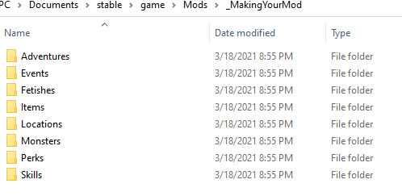

.. _Overview:

**Making Your Mod**
====================

.. note::
    It is expected that you have already `installed a mod <https://monstergirldreams.fandom.com/wiki/Category:List_Of_Mods>`_
    at least once, and thus are familiar with accessing the base game folder on your respective platform.

It is important to know how content is created in Monster Girl Dreams first, to understand how you will be modding.

To start, you will not be coding in python.
Instead, you will be utilizing a custom data-driven modding environment Threshold specifically made for developing content, in a text file format called JSON.

You can find the .json files for the base game in *game/Json/*.
You will find all of the games .json files to be plainly readable and modifiable as-is.
You can also find music, images, and sound effects called upon by the .json files in *game/music/*, *game/images/*, and *game/sfx/* respectively.

However, you will not be working in these folders directly. That can cause all sorts of issues.
As you're likely familiar with, your creation goes in *game/Mods/* as a unique folder containing your mods contents in its entirety.

You simply start by creating a folder with your chosen mod name in *game/Mods*.
You can use a placeholder name for now and freely rename it later once you feel ready to start seriously making your mod.
Your mod folder can contain anything you please, but there is of course one file type the game will be somewhat particular about: JSON.

**JSON Folders**
-----------------

The game will expect your .json files to be organized in starting base folders of particular names, so it can easily locate and load them into the correct databases on startup.
While maybe obvious, **do not place base folders inside one another**.

To make a base folder, simply create a folder within your mod folder named as exactly one of the emboldened types in this comprehensive list:

* **Adventures** | Adventures are the menu choices you make on the game map, including the first-time runs you do before you fully unlock a location's menu choices. Examples would be "Shortcut To Nara" or "Visit Amy". These menu choices will proceed to point to an Event if the player meets any requirements.

* **Events** | Events encompass the vast number of scenes and moments within the game. They are near all instances of the text you read in the textbox at the bottom of the game screen, including things the player doesn't see, such as scene jump logic, altering music or images, or calling stat checks. Events are even used during combat encounters when just a Skill JSON is too simple. An example would be the blue slime asking if you are okay with anal insertion.

* **Fetishes** | Contains both fetishes **and addictions** for the game. That's right, mods can go as far as introducing new fetishes. Lesser known are addictions, which track particular milestones with characters. They work in a very similar manner and fall under the same system, but are typically hidden from the player. Use them both with care.

* **Items** | Contains consumables, equipment, and key items, defining their values and effects.

* **Locations** |  Locations are spots on the game map when you select "Go Adventuring!" from the town, defining their icon, adventure, and Grimoire details. Note the town itself is hard-coded, and thus isn't modded like you would other existing locations. Instead, mods can access the town by creating Event JSONs.

* **Monsters** | Not only do monsters go here, but **also NPCs** in the town, or generally any character, defining their visual and/or visual description, and combat values.

* **Perks** | Encompasses perks acquired by the player in the game, and perks only usable by enemies, defining their values and effects.

* **Skills** | Covers skills used by the player and enemies in the game, defining their values, effects, and the skill's combat line. Skills sometimes point to Events for more complex behaviors.

.. tip::
    You only need to include any of the above base folders if you intend to use that type of content.

While *game/Json/* follows this ruling as well, you do not have to follow how Threshold chose to organize the content within the base folders.
Once the relevant base folders to your mod are set, the .json files under them can be organized however you want.

That said, checking how Threshold chose to organize the contents of the base folders can be a useful starting point to decide how you'd like to organize.
Most especially, do give the .jsons within *game/Json/* a look whenever you want to see reference and better understand how Threshold makes the games content.
Checking other peoples mods can also help with comprehending the modding process.

Lastly, if you have incomplete .json files or an entire folder of .json files that aren't yet ready and you don't want it to be loaded by the game on startup,
put a _underscore at the beginning of its name to prevent the game from including it. You can see the base game utilizing this for template and example JSON files.

.. _Music And Art Summary:

**Music and Art Summary**
--------------------------

As previously stated, you can put any number of non-JSON files anywhere inside your mod folder, including media assets used by the game.
Just do try to be sensible with what you include with your mod. Always review licenses of copyrighted materials, and give credit to your sources.

MGD supports the following image file types:

* PNG (not only recommended, but also specifically required for Location image backgrounds)
* WEBP
* JPG (not recommended due to transparency being unsupported by JPG files)

Supported audio file types:

* Opus
* Ogg Vorbis
* MP3
* WAV (uncompressed 16-bit signed PCM only)

The file path to the compatible file type can then be referred to within .json files, with a caveat;
the game is expecting the hard-coded base game filepath structure for assets, such as *game/images/* or *game/music/*.
To combat this, mods provide the game with a file path structure similar to the code block below.

::

  "../Mods/<modName>/folder/file.extensiontype"

To explain, *../* tells the game that you wish to go back a directory. So if you were in *Directory/FolderA/FolderB/*, using *../* will take you to *Directory/FolderA/*.
Any image, music, or sound will require you to go back up by one folder, as in the code block above.
Map related assets are two directories deep (*images/map/*), so you will need to use *../* twice in cases where you are making a new location on the map.

**Console**
------------

The in-game console can be very useful for debugging and testing your mod at a rapid pace, without having to manually build up a save towards what you want.
`See the game wiki for further information. <https://monstergirldreams.fandom.com/wiki/Console>`_

**Releasing Your Mod**
-----------------------

When you feel your work is ready to be shared with the world, you can use the following file hosts. Feel free to use others, just keep in mind not all may be willing to host NSFW games.

**Uploading**
""""""""""""""

* `Mega <https://mega.nz/start>`_ for its more than sufficient user-side download limit of 10GB, and download speed. Features lifetime hosting, though users have had difficulties, including once MGD. It also requires an account to upload.
* `Anonfile <https://anonfile.com/>`_ has good download speed, file cap of 20GB, and lifetime hosting. While it has yet to be used to host an MGD mod, there are plenty of other NSFW projects that have used this platform as their host, including MGD.
* For the technically inclined, `Github <https://github.com/>`_ doubles as a place for people to download your mod, and to help you manage your work. Especially useful for those who intend to collaborate. While historically permissing NSFW git projects, keep in mind their `use policies <https://docs.github.com/en/github/site-policy/github-acceptable-use-policies>`_ is vague on restrictions for sexual content.
* `MGD Discord <https://discord.com/invite/monstergirldreams>`_. Upload your up to 100MB mod alongside your post in #mod-posting, and you can share the direct download link anywhere else, without requiring the user to open Discord. Keep in mind `Discord Community Guidelines <https://discord.com/guidelines>`_.

**Where To Share**
"""""""""""""""""""

There are two places in particular you are encouraged to share the link to your mod for optimal exposure to the MGD community.

* The Mod List page on the `wiki <https://monstergirldreams.fandom.com/wiki/Category:List_Of_Mods>`_. There is a tab in the How-To Guides section for how you should format your row in the table, to keep the presentation clean. Links to NSFW mods have been historically accepted, but still do keep in mind `Fandom Commmunity Guidelines <https://community.fandom.com/wiki/Fandom_Community_Guidelines>`_. The popularity of downloads here is only second to...
* In #mod-posting on the `MGD Discord <https://discord.com/invite/monstergirldreams>`_. This makes up for a majority of mod downloads during your first week or two of launch, then most traffic will be coming from the wiki. If you want instantaneous exposure and feedback for your creation, this place will get you it. Keep in mind `Discord Community Guidelines <https://discord.com/guidelines>`_.
